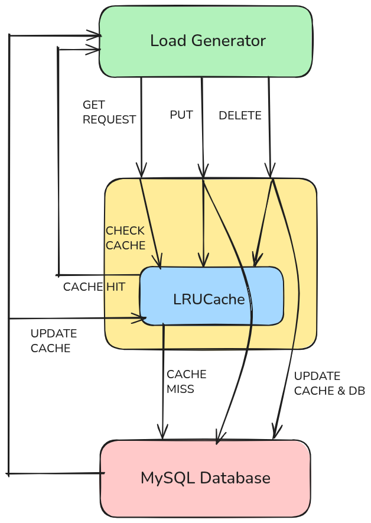

# DECS-KV-server
Github repo for the implementation of HTTP Based KEY-VALUE server for CS744

This project implements a multi-tier Key-Value (KV) storage system designed to analyze performance bottlenecks under various concurrent workloads.


## System Architecture

The KV system employs a standard multi-tier design to decouple high-speed caching from durable storage.

| **Component**      | **Tier**              | **Role**                                                                                                                                                                                | **Technology / Implementation**                                   |
|--------------------|-----------------------|----------------------------------------------------------------------------------------------------------------------------------------------------------------------------------------|-------------------------------------------------------------------|
| **Load Generator** | Client               | Emulates high-volume concurrent users (closed-loop model) and measures global throughput and response time.                                                                         | C++17 (`std::thread`, `cpp-httplib`, `std::atomic`)                 |
| **KV Server**      | Tier 1 (Frontend)    | Multi-threaded HTTP server using `cpp-httplib`. Incorporates a thread-safe **In-Memory Cache (`LRUCache`)** with an LRU eviction policy.                                             | C++17 (`cpp-httplib`)                                             |
| **Database**       | Tier 2 (Backend)     | Provides persistent storage for all key-value pairs. Serves as the designated I/O bottleneck.                                                                                      | MySQL (`MySQLXDev API`)                                          |

## Schematic Diagram of System Architecture



### Cache Updation Policies

| **Operation**          | **Policy & Flow**                                                                                                                                                                                                 |
|-------------------------|------------------------------------------------------------------------------------------------------------------------------------------------------------------------------------------------------------------|
| **GET (Read)**          | **Cache-First :** Check cache → If hit, return immediately. → If miss, lock DB, fetch from DB, bring to cache (Evict victim from cache, if needed), unlock DB, return.                                                                |
| **PUT (Create/Update)** | **Write-Through:** Lock DB, write to DB, update cache → Unlock DB.                                                                                                        |
| **DELETE**              | **DB-First & Invalidate:** Lock DB, delete from DB invalidate cache entry, → Unlock DB.                                                                            |

## Project Directory Structure

The repository is structured to separate source files, build scripts, and external headers (cpp-httplib.h is accessible by the compiler via -I flags).\
\
.  
├── include/  
│ &emsp;  ├── httplib.h&emsp;&emsp;&emsp;&emsp;&emsp;&emsp;&emsp;&emsp;&nbsp;&nbsp;# Header file to include cpp-httplib library  
│ &emsp;  ├── LRUCache.h &emsp;&emsp;&emsp;&emsp;&emsp;&emsp;&emsp;# Implementation of a templated LRUCache, to be used by the KVServer    
├── build/  
│ &emsp;  ├── Makefile &emsp;&emsp;&emsp;&emsp;&emsp;&emsp;&nbsp;&nbsp;&nbsp;# Build script for compiling the server and client.  
│ &emsp;  ├── server &emsp;&emsp;&emsp;&emsp;&emsp;&emsp;&emsp;&nbsp;&nbsp;   # Compiled Server Executable.  
│  &emsp; └── load_generator&emsp;&emsp;&emsp;&nbsp;&nbsp;&nbsp;# Compiled Load Test Client Executable.  
└── src/  
|  &emsp;  ├── client/  
|  &emsp;  │  &emsp;  └── unified_load_generator.cpp  &emsp;&emsp;&emsp;# Unified client for all workloads (GET/PUT/DELETE/MIX).  
|  &emsp; └── server/  
|  &emsp; |  &emsp;  └── KVServer.cpp &emsp; &emsp;&emsp;&emsp;&emsp; # Implementation of KVServer methods and main() loop.  
|  &emsp; |  &emsp;  └── KVServer.h &emsp;&emsp;&emsp;&emsp;&emsp;&emsp;&nbsp;&nbsp;# Class definitions for KVServer.  


## Build Instructions

The following environment variables need to be set for the application to access the database correctly.

```
export DB_USER="username for your database"  
export DB_PASS="password to access your database"  
export DB_HOST="hostname for your database"  
export DB_NAME="Name of the table"
```

Follow the following steps to build the application
```
cd build 
make -j
```

## Execution and Load Testing


To the run the **KVServer**, from inside the ```build``` directory run
```
./server
```
The output should be displayed as 

```
KVServer is running ...
```

To run the load generator, from inside the ```build``` directory run

```
./load_generator [number of concurrent threads] [test duration] [workload type]
```

The number of different workloads supported are 

```
put                    
get  
delete  
get_popular  
get_put_mix  
get_delete_mix  
```

To pin a process to a particular CPU Core

```
taskset -c {CPU Core number} {Executable}
```


The following commands can be used to measure the disk utilization percent.

```
iostat -ms -x [delay in seconds]
```

To check the CPU Utilization of a particular core 

```
mpstat -P {CPU core number} [delay in seconds]
```


